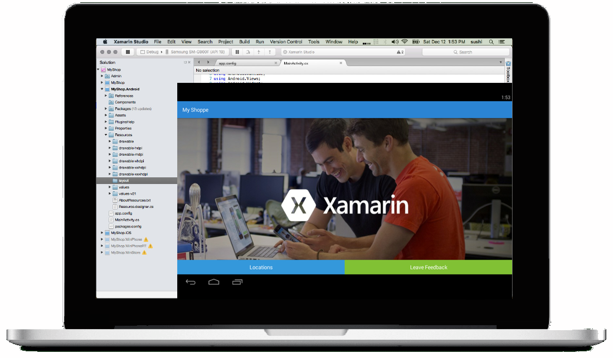
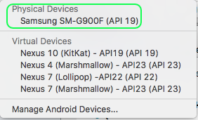
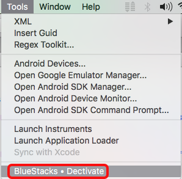
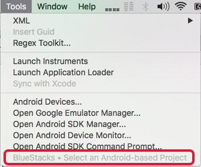

#Xamarin Studio BlueStacks Addin

Note: Windows is not currently enabled in this project, please post your vote to the GitHub issue

####Use the [BlueStacks Android Player](http://www.bluestacks.com) as a debug target for your Xamarin Studio Android projects.

## BlueStacks = Android API 19 Device

When activated as an ADB debug device within Xamarin Studio, BlueStacks will be listed under "Physical Devices" and displayed as "Samsumg SM-G900F (API 19)"

## Xamarin Studio - Tools Menu

The menu item for the BlueStacks activation will change state based on the following:

 * Is BlueStacks installed?
 * Is an Android project currently open and selected?
 * Is BlueStacks currently running?
 * Is BlueStacks available, or not, as a debug device?

####Active BlueStacks as a debug device:

####Remove BlueStacks as a debug device:

####A Xamarin.Android project is not open and active:

Note: The BlueStacks menu item will be disabled

####BlueStacks is not installed:

Note: BlueStacks does not have to exist in the typical /Applications or ~/Applications install locations. As long as OS-X Finder's location service can find it, it can be used.

##Disclaimer: 

I have no connection to BlueStacks other than as an end-user and this is not a direct endorsement for their product (other than as a satified user).
