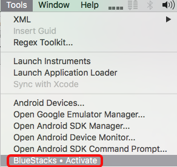

#Xamarin Studio Addin for BlueStacks
####Use the [BlueStacks Android Player](http://www.bluestacks.com) as a debug target for your Xamarin Studio Android projects.

> Xamarin's My Shoppe app runnning in debug mode on BlueStacks

**Note**: Windows is not currently enabled in this project, please post your [vote](https://github.com/sushihangover/SushiHangover.BlueStacks.Addin/issues/1)

##Why:

* It is a fully licensed Android client:
	* **Play Store access**
	* **Google Apps available** (Maps, Mail, etc...)
	* **Google Play services**
* 100+ million BlueStacks' end-users (per company statement)
* BlueStacks is a ***really*** fast Android client 
* BlueStacks does OpenGL ES based apps really well.

## BlueStacks = Android API 19 Device

When activated as an ADB debug device within Xamarin Studio, BlueStacks will be listed under "Physical Devices" and displayed as "Samsumg SM-G900F (API 19)"

## Xamarin Studio - Tools Menu

The menu item for the BlueStacks activation will change state based on the following:

 * Is BlueStacks installed?
 * Is an Android project currently open and selected?
 * Is BlueStacks currently running?
 * Is BlueStacks available, or not, as a debug device?

####Active BlueStacks as a debug device:

####Remove BlueStacks as a debug device:

####A Xamarin.Android project is not open and active:

Note: The BlueStacks menu item will be disabled

####BlueStacks is not installed:

*Select the menu item to go to BlueStacks to download their Player.*

Note: BlueStacks does not have to exist in the typical `/Applications` or `~/Applications` install locations. As long as OS-X Finder's location service can find it, it can be used.

##"My Shoppe" Example on BlueStacks:

#### **How well does your app scale? "My Shoppe" does it the right way...**

###Original application size on BlueStacks:

###Select "Tablet" size for the app:

###Tablet size "My Shoppe":

##Disclaimer: 

I have no connection to BlueStacks other than as an end-user and this is not a direct endorsement for their product (but I am a happy end-user...).

## License:

The MIT License (MIT) (see `LICENSE.md`) 